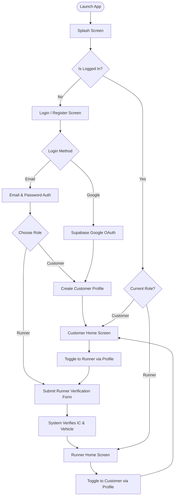
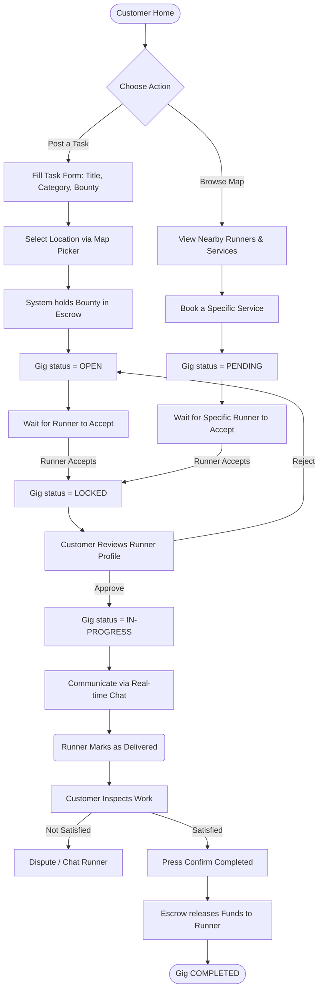
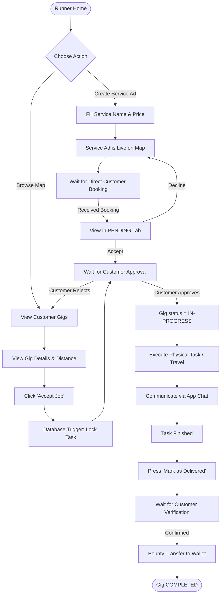

# Ngam App: User Flow (For Report)

This document contains the structural User Flows for the Ngam application. You can use these diagrams and explanations directly in your system analysis or design report. 

*(**Tip**: You can screenshot the generated charts below and paste them into your report!)*

---

## 1. High-Level Registration & Onboarding Flow

This flow shows how a new user enters the system, registers, and utilizes the Dual-Role architecture.

---

## 2. Customer Journey (Requesting a Gig)

This diagram illustrates the step-by-step process a Customer takes to post a job and get it completed by a Runner.

---

## 3. Runner Journey (Finding & Executing Jobs)

This diagram shows how a Runner finds jobs on the map, executes them, and receives payment via Ngam Pay.

---

## How to Explain This in Your Report

If your lecturer asks you to explain the User Flow in text, you can write it like this:

### 1. Unified Authentication Flow
> *"The system uses a Unified Authentication model. When a user first opens the app, they undergo standard authentication. Upon successful login, the system evaluates their role. A unique feature of this flow is the **Dual-Role Toggle**, which allows users to seamlessly switch between the Customer dashboard and the Runner dashboard without requiring a secondary application or re-authentication."*

### 2. The Job Execution Pipeline
> *"The core business logic relies on a rigorous state-machine flow. A task begins as `OPEN` when broadcasted to the map. Once a runner intercepts the task, the state mutates to `LOCKED`. This state strictly requires the Customer's manual approval to proceed to `IN-PROGRESS`. This explicit handshake prevents unauthorized task execution and guarantees mutual agreement before the SLA countdown begins."*

### 3. Financial Escrow Flow
> *"Parallel to the user flow is the financial data flow. When a Customer creates a task, the specified bounty is immediately deducted from their digital wallet and held in a secure Escrow state. The funds only proceed to the Runner's wallet at the terminal state (`COMPLETED`), ensuring absolute financial security for both entities."*
