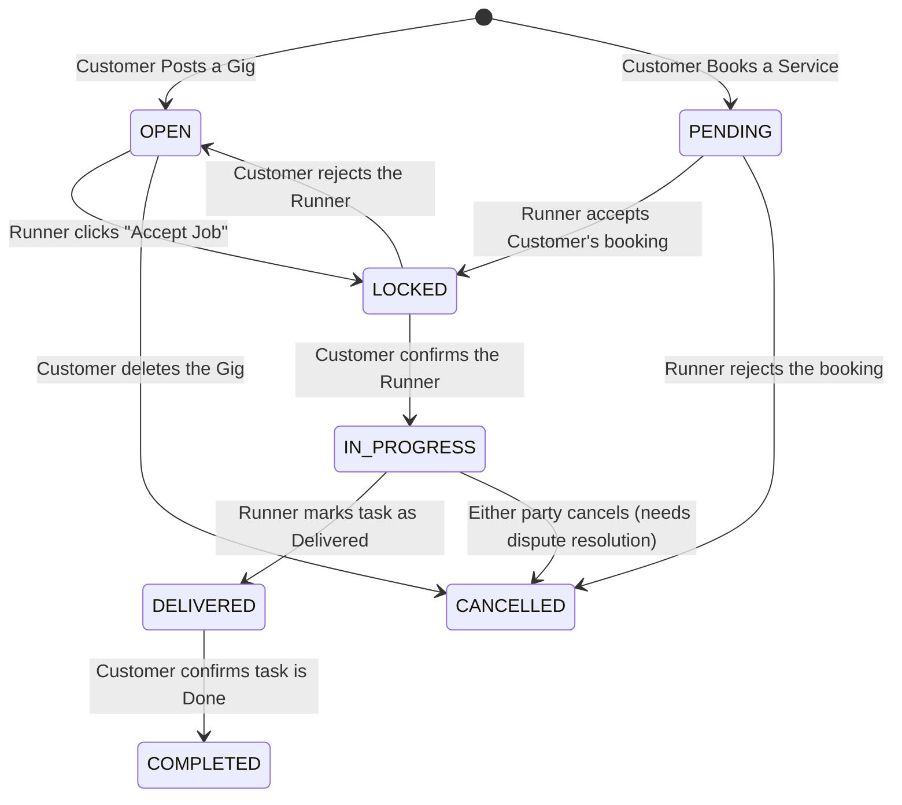

# Ngam App User Manual

Welcome to **Ngam - Roger Anything, Kautim Instantly**. Ngam is a community app that connects people who need help with daily tasks (Customer) with those ready to help (Runner). 

This manual covers all the core functions and advanced features of the app, from registration to task completion.

---

## 1. Getting Started

### 1.1 Registration & Login
- **Standard Email Registration**: While registering with an email and password, you can immediately choose your role as a **Customer** or **Runner**. If you choose Runner, the *Runner Details* form (IC & Vehicle) will appear to be completed during registration.
- **Google Login**: For a fast process, you can use your Google Account. By default, logging in via Google will register you as a **Customer**.
- After registration, make sure to update your basic profile (Full Name, Profile Picture, Phone Number) to make it easier for other users to contact you.

### 1.2 Dual-Role System & Runner Verification
- **One Account, Two Functions**: You don't need to register separate accounts to be a user or a deliverer.
- **From Customer to Runner**: If you registered using a Google account (or registered as a Customer initially), you can always apply to be a Runner within the app.
- **Steps to Become a Runner (For Existing Accounts)**: If you try to register again on the *Register* page as a Runner using the same Customer email, the system will not allow duplicate accounts. Instead, simply **Log In** normally, go to the **Profile** menu, and tap the *Toggle* button to Runner. The *Runner Verification* form (IC, License Plate, Vehicle Type) will automatically appear for you to fill in.
- **Switching Roles**: Once verification is successful, you are now a registered Runner. After this, you are free to switch roles between Customer <-> Runner anytime in a blink of an eye!

### 1.3 Language & Theme Settings
- **Dual-Language**: The Ngam app supports **English** and **Malay**.
- **Dark Mode**: You can also switch the display to *Light* or *Dark Mode*.
- **How to Change**: You can configure Language & Theme directly at:
  1. **Login Page (Sign In / Register)**: Tap the button at the top right of the screen before registering.
  2. **Profile Page**: There is a dedicated toggle button to change the theme and language anytime. The system will automatically save your preferences.

---

## 2. Ngam Pay (Digital Wallet System)

Ngam comes with a built-in digital wallet, **Ngam Pay**, to ensure every transaction runs smoothly, securely, and free from scams.

### 2.1 Top Up
1. Go to the **Wallet** page.
2. You can add a Payment Method like Credit/Debit Card or use Online Banking.
3. Tap the **Top Up** button, enter the desired amount, and confirm. Your wallet balance will be updated in real-time.

### 2.2 Add Payment Method (Card / Bank Account / DuitNow QR)
The system allows you to securely save card, bank account, or DuitNow QR information in the wallet.
1. On the **Wallet** page, scroll down until you find the **Payment Methods** section.
2. Tap the card box marked **+ Add New**.
3. Select the type of method you want to add:
   - **Bank Account**: Choose your bank (e.g., Maybank, CIMB) and enter the account number. This is crucial for enabling Withdrawals.
   - **Credit / Debit Card**: Enter the card number, expiry date, and CVV (securely encrypted).
   - **DuitNow QR**: Specifically for Runners to receive payments, upload a verified QR image (unedited).
4. This info will be saved as a "Card" that can be swiped in the Payment Methods section.

### 2.3 Withdraw
- The *Withdraw* function allows funds from the wallet to be transferred directly to your bank account.
- **Important**: You MUST register your Bank Account Information (Refer to 2.2) in the system first before the withdrawal function can be used.
- The withdrawal process is secure, and your wallet balance will be deducted automatically based on the withdrawal amount.

### 2.4 DuitNow QR & Anti-Scam System
- Runners can upload their **DuitNow QR** image.
- When it's time for payment, Ngam will display the original QR code (uncropped and unedited) so Customers can visually check the registrant's full name in their banking app. This prevents fake profile impersonation scams.

---

## 3. Booking Workflow & Status Meanings (Crucial)

To understand how the app connects Customers and Runners, you must understand the two ways to create a job and what the statuses mean.

### 3.1 The Two Types of Bookings

There are two ways a job can be created on Ngam:

**A. Customer Posts a Gig (Runner Accepts)**
1. **Customer** opens the **Post Task** tab (the '+' icon).
2. Customer fills in the task details (e.g., "Buy Groceries"), sets a Bounty, and Submits.
3. The Gig appears on the map for all Runners.
4. A **Runner** finds it on the map and clicks **Accept Job**.

**B. Customer Books a Runner's Service (Runner Confirms)**
1. A **Runner** creates a Service Ad (e.g., "Laptop Formatting - RM50") via their **My Jobs** tab.
2. The **Customer** sees this specific service on the map and clicks **Book Service**.
3. The booking goes directly to that specific Runner for confirmation.

### 3.2 Job Status Workflow

Understanding the status of a job is important. Here is the full lifecycle:

**What each status means:**

- **OPEN**: The task is published on the map. It is waiting for *any* Runner to accept it.
- **PENDING**: A Customer has directly booked a Runner's specific service. It is waiting for *that specific Runner* to accept or decline the booking.
- **LOCKED**: A Runner has accepted an OPEN gig OR accepted a PENDING booking. The task is now waiting for the **Customer** to give the final approval (confirmation) before work begins. During this state, the bounty is held in Escrow.
- **IN_PROGRESS**: The Customer has approved the Runner! Work has officially started. The Chat room is now active.
- **DELIVERED**: The Runner has finished the work and tapped "Mark as Delivered". Waiting for Customer's final check.
- **COMPLETED**: The Customer has verified the work is good. The money in Escrow is released into the Runner's wallet.
- **CANCELLED**: The task was cancelled before completion.

---

## 4. Customer Mode (When You Need Help)

### 4.1 Managing Tasks (My Tasks)
You can monitor all your tasks in the **My Tasks** section.
- **Sort Function**: Use the arrow button next to the "My Tasks" title to sort the task list from **Newest** to **Oldest**.
- **Locked Stage Action**: If a task is `LOCKED`, you must review the Runner's profile and approve them. Only then will the task become `IN_PROGRESS`.
- **Completion Action**: Once the task is `DELIVERED`, you must tap "Confirm" to change it to `COMPLETED` so the Runner gets paid.

---

## 5. Runner Mode (Make Extra Money)

### 5.1 Managing Jobs (My Jobs)
- **Accepting Jobs on Map (OPEN -> LOCKED)**: When you find an OPEN task on the Map and press "Accept Job", a confirmation popup will appear. If you accept, the task becomes `LOCKED`. Wait for the Customer to approve you.
- **Receiving Direct Bookings (PENDING -> LOCKED)**: If you posted a service, Customers might book it directly. Check your "Customer Bookings" section. These tasks will be `PENDING`. Tap on them to **Accept** or **Decline**. If accepted, it becomes `LOCKED` until the Customer gives final approval.
- **In-Progress**: Once the Customer approves, you can chat and do the work. When done, press **Mark as Delivered**.

---

## 6. Advanced AI & Unique Features

### 6.1 AI Voice Assistant (Ngam AI)
- On the main screen, there is an AI smart assistant. You can type or **speak directly** (Speech-to-Text)!
- **Example Commands**:
  - *"Please find the most expensive job around here."*
  - *"Does anyone need food delivery services?"*
- The AI will scan all nearby jobs *live* and tell you the results. 
- Ngam AI supports casual language (Manglish/Malay).
- **Text-to-Speech (TTS)**: The AI will reply to you with a voice so you don't have to read text while driving or walking.

### 6.2 Real-time Chat & Voice
- Every task provides a dedicated chat room.
- You can send normal text messages.
- **Voice Dictation**: Too lazy to type? Use the built-in microphone icon in the chat to automatically convert your speech into text!

### 6.3 "Liquid Glass" Interface (Glassmorphism)
- The app is built with a modern design theme called *Liquid Glass*. You will notice transparent blur elements, micro-light effects, smooth animations that give a premium iOS-like feel, as well as elegant **Glass Toast** notifications.
- **Dark Mode / Light Mode**: Supported automatically according to your smartphone's settings.

---

## 7. Ngam Security Features (Security & Privacy)

### 7.1 Data & Access Security (Supabase & RLS)
- **Secure Login**: World-class authentication support using the Supabase Auth system.
- **Row Level Security (RLS)**: Ngam uses strict Database Policies. This means your personal data, chat messages, and wallet balance are locked at the server level and **only you** can view/modify them. Third parties cannot hack your data.

### 7.2 "Escrow" Payment System
- **Financial Guarantee**: Customers don't need to worry about Runners running away without doing the job, and Runners don't need to worry about not getting paid after working hard. 
- When a task is agreed upon, the money will be pulled into the *Escrow* system (Ngam's safe holding). This money will only be released to the Runner *after* the Customer presses the confirm job completed button (Completed).

### 7.3 Map Location Privacy
- The map only displays the location where the Task needs to be done. 
- **Your actual GPS location is always safe and hidden** from public view to avoid any privacy intrusion.

### 7.4 Device Privacy Controls (App Lock & App Switcher)
You can further tighten the security of the Ngam app on your phone via the **Profile > Privacy & Security** menu:
1. **App Lock**: You can activate App Lock using a fingerprint (Biometrics) or phone PIN. You can set a time (Immediately, 1 min, 15 min, 1 hour) so the app locks automatically when you exit (minimize).
2. **Hide in App Switcher (Blur Screen)**: Activate this feature to blur the Ngam app display when you open the *Recent Apps* or *App Switcher* function on your phone. This prevents people next to you from peeking at your Ngam Pay balance or private chats from afar.

---

## 8. In-App Chat System

Ngam has a highly interactive built-in messaging/chat function to facilitate communication between Customer and Runner:
1. **Real-time Messaging**: Messages are sent and received instantly without needing to *refresh*.
2. **Presence Status (Online/Offline)**: You can see if the other party is 'Online'.
3. **Typing Indicator**: You will see a small animation when the other party is typing a message.
4. **Message Search**: You can use the *Search* function to find old messages.
5. **Auto-Scroll to Bottom**: Ensures new incoming messages always appear instantly on the screen.

*(Important Note: The swiping / Carousel function only exists on the Map/Discover page. If you want to open Chat for different tasks, you need to go to the My Tasks/My Jobs page and press the Chat button on the respective task card.)*

---

## 9. Help & Support

- If there are any disputes or technical issues (e.g., Runner didn't finish the job, or refund hasn't arrived), use the **Help & Support** button in the Profile section. 
- The Ngam Team is always ready to help you review the chat logs and refund money fairly in the event of fraud.

> [!TIP]
> Always check the *push* notifications on your mobile phone and enable location permissions (GPS Permission - Always/While In Use) to experience the optimal Ngam app experience.

Thank you for using Ngam. Keep on **"Roger Anything, Kautim Instantly"**!
